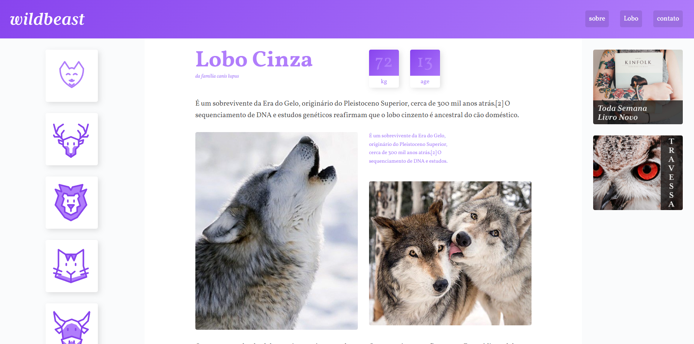

# Wildbeast



Site estático do projeto **Wildbeast** — layout responsivo com **CSS Grid** (áreas nomeadas via `grid-template-areas`), tipografia clara e conteúdo organizado.

> **Demo:** https://zatticode.github.io/wildbeast  
> **Repositório:** https://github.com/ZattiCode/wildbeast

---

## ✨ Funcionalidades

- Layout **responsivo** (mobile-first)
- **CSS Grid** com áreas nomeadas (header, nav, conteúdo, sidebar, footer)
- Estrutura semântica em **HTML5**
- Hierarquia tipográfica e bom espaçamento
- Conteúdo com imagens em destaque
- Organização simples de assets

## 🧱 Tecnologias

- **HTML5**
- **CSS3** (Grid/Flexbox)
- **JavaScript** (interações leves, se aplicável)

> *Observação:* projeto 100% estático — não requer backend.

## 🚀 Como rodar localmente

1. **Clone** o repositório:

```bash
git clone https://github.com/ZattiCode/wildbeast.git
